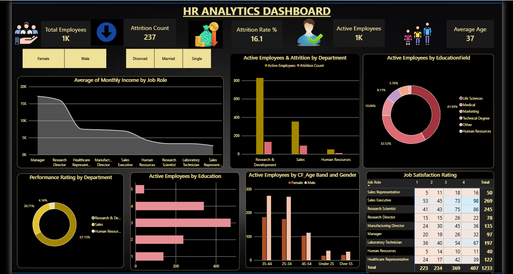
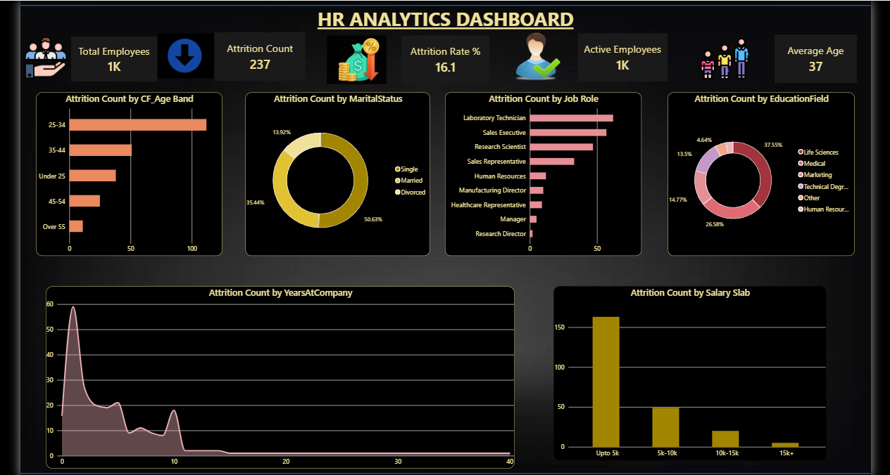
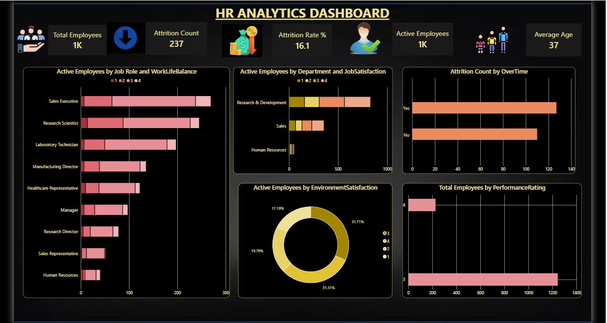
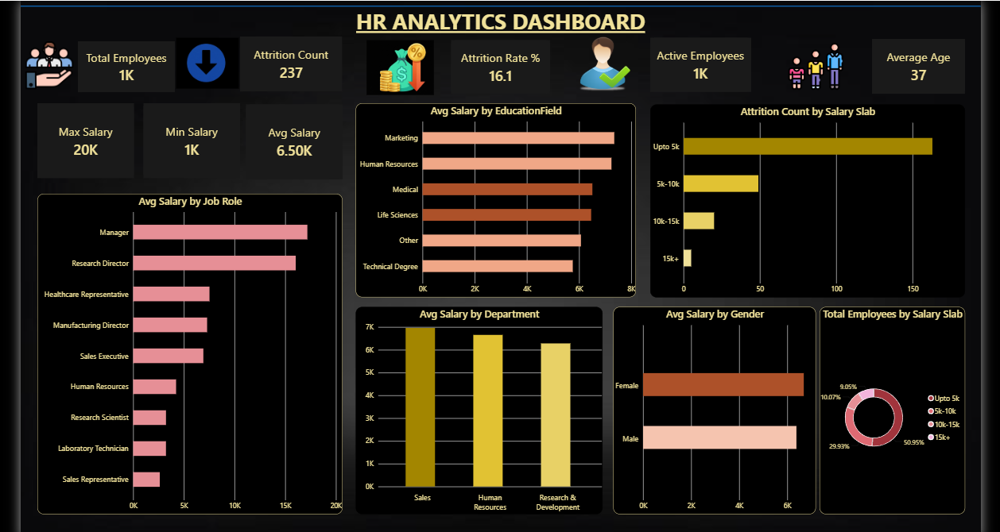
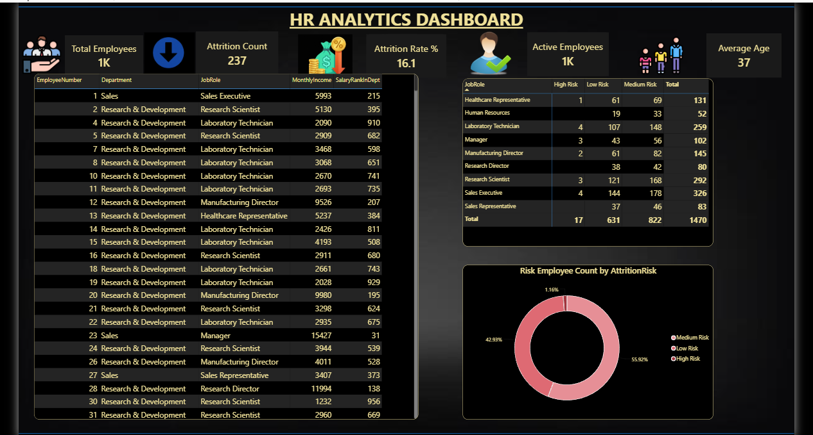

# HR Analytics Dashboard — SQL Server + Power BI


## 📌 Project Overview

An end-to-end HR Analytics solution built using **SQL Server** and **Power BI**. Raw employee data was imported into a SQL Server database, cleaned and transformed using SQL queries and views, then connected directly to Power BI for interactive dashboard reporting.

This project demonstrates a complete data analyst workflow — from database setup and SQL analysis to DAX measures and professional dashboard design.

---

## 🛠️ Tools & Technologies

| Tool | Usage |
|---|---|
| SQL Server Express | Database, data storage |
| SSMS (SQL Server Management Studio) | Query writing, view creation |
| Power BI Desktop | Dashboard design, DAX measures |
| T-SQL | Data analysis, window functions, views |
| DAX | Calculated measures and columns |

---

## 📊 Dataset

- **Source:** IBM HR Analytics Employee Attrition & Performance (Kaggle)
- **Size:** 1,470 employee records, 35 columns
- **Link:** https://www.kaggle.com/datasets/pavansubhasht/ibm-hr-analytics-attrition-dataset

**Key columns:** Age, Attrition, Department, JobRole, MonthlyIncome, JobSatisfaction, WorkLifeBalance, YearsAtCompany, PerformanceRating, OverTime, Gender, EducationField

---

## 🗄️ SQL Work

### Database Setup
- Created `HR_Analytics` database in SQL Server
- Designed and created `HR_Employees` table with correct data types
- Imported 1,470 rows using `BULK INSERT`

### Analyst Queries Written
```sql
-- Headcount by department
-- Attrition rate by department (CASE WHEN + aggregation)
-- Average salary by job role (GROUP BY + MIN/MAX/AVG)
-- Gender split with percentage (Subquery)
-- Salary rank within department (RANK() OVER PARTITION BY)
-- Employee salary vs department average (Window Function)
-- Attrition risk scoring (CASE WHEN logic)
```

### SQL Views Created (used directly in Power BI)
| View | Description |
|---|---|
| `vw_AttritionByDept` | Attrition count and rate grouped by department |
| `vw_SalaryByRole` | Average, min, max salary grouped by job role |
| `vw_AttritionRisk` | Per-employee attrition risk score (High/Medium/Low) |
| `vw_SalaryRank` | Employee salary rank within their department |

---

## 📈 Power BI Dashboard — 5 Pages

### Page 1 — Workforce Overview

- KPI cards: Total Employees, Attrition Count, Attrition Rate, Active Employees, Average Age
- Charts: Active Employees by Department, Education Field, Age Band & Gender
- Slicers: Gender, Marital Status

### Page 2 — Attrition Analysis

- Attrition by Age Band, Job Role, Salary Slab, Years at Company
- Attrition by Education Field and Marital Status

### Page 3 — Employee Wellness

- Work Life Balance by Job Role
- Job Satisfaction by Department
- Overtime vs Attrition
- Environment Satisfaction, Performance Rating Distribution

### Page 4 — Salary Analysis

- Avg Salary by Job Role, Department, Gender, Education Field
- Salary Slab Distribution
- Salary vs Attrition correlation

### Page 5 — Employee Detail & Attrition Risk

- Individual employee salary rank table
- Attrition Risk matrix by Job Role
- Risk distribution donut chart

---

## 🔍 Key Insights Found

1. **Sales has the highest attrition** — 20.6% vs 13.8% in R&D
2. **Low salary is the #1 attrition driver** — 160+ exits from employees earning under ₹5K/month
3. **Overtime employees leave more** — Yes group has significantly higher attrition count
4. **25–34 age group** has the highest attrition — young employees leaving most
5. **Single employees** account for 50.6% of attrition — highest among marital status groups
6. **Managers earn ~5x more** than Sales Representatives (₹17K vs ₹2.6K avg monthly)
7. **Only 1.16% of employees are High Risk** — majority (55.9%) are Low Risk

---

## 🧮 DAX Measures Written

```dax
Total Employees = COUNTROWS('Employees')
Attrition Count = COUNTROWS(FILTER('Employees', 'Employees'[Attrition] = "Yes"))
Active Employees = COUNTROWS(FILTER('Employees', 'Employees'[Attrition] = "No"))
Attrition Rate % = DIVIDE([Attrition Count], COUNTROWS('Employees')) * 100
Avg Age = AVERAGE('Employees'[Age])
Avg Salary = AVERAGE('Employees'[MonthlyIncome])
High Performers = COUNTROWS(FILTER('Employees', 'Employees'[PerformanceRating] = 4))
Overtime Employees = COUNTROWS(FILTER('Employees', 'Employees'[OverTime] = "Yes"))
```

### Calculated Columns
```dax
CF_Age Band = SWITCH(TRUE(),
    'Employees'[Age] < 25, "Under 25",
    'Employees'[Age] <= 34, "25-34",
    'Employees'[Age] <= 44, "35-44",
    'Employees'[Age] <= 54, "45-54",
    "Over 55")

Salary Slab = SWITCH(TRUE(),
    [MonthlyIncome] <= 5000, "Upto 5k",
    [MonthlyIncome] <= 10000, "5k-10k",
    [MonthlyIncome] <= 15000, "10k-15k",
    "15k+")
```

---

## 📁 Repository Structure

```
HR-Analytics-Dashboard/
│
├── data/
│   └── WA_Fn-UseC_-HR-Employee-Attrition.csv
│
├── sql/
│   ├── SQLQuery1.sql          # Database setup, table creation, analyst queries
│   └── SQLQuery3.sql          # SQL Views for Power BI
│
├── screenshots/
│   ├── page1_workforce_overview.png
│   ├── page2_attrition_analysis.png
│   ├── page3_employee_wellness.png
│   ├── page4_salary_analysis.png
│   └── page5_employee_detail.png
│
├── HR_Analytics_Dashboard.pbix
└── README.md
```

---

## 🚀 How to Run This Project

1. Install **SQL Server Express** and **SSMS**
2. Run `sql/SQLQuery1.sql` to create the database and import data
3. Run `sql/SQLQuery3.sql` to create the 4 views
4. Open `HR_Analytics_Dashboard.pbix` in Power BI Desktop
5. Update the SQL Server connection to `localhost` (or your server name)
6. Refresh data — all 5 pages will load automatically

---

## 👩‍💻 Author

**Shabnam** — Data Analyst | SQL | Power BI | Python | Azure

- LinkedIn: linkedin.com/in/shabnam-521872310
- GitHub: github.com/shabnamsoniya-cpu
- Email: shabnamsoniya@gmail.com
